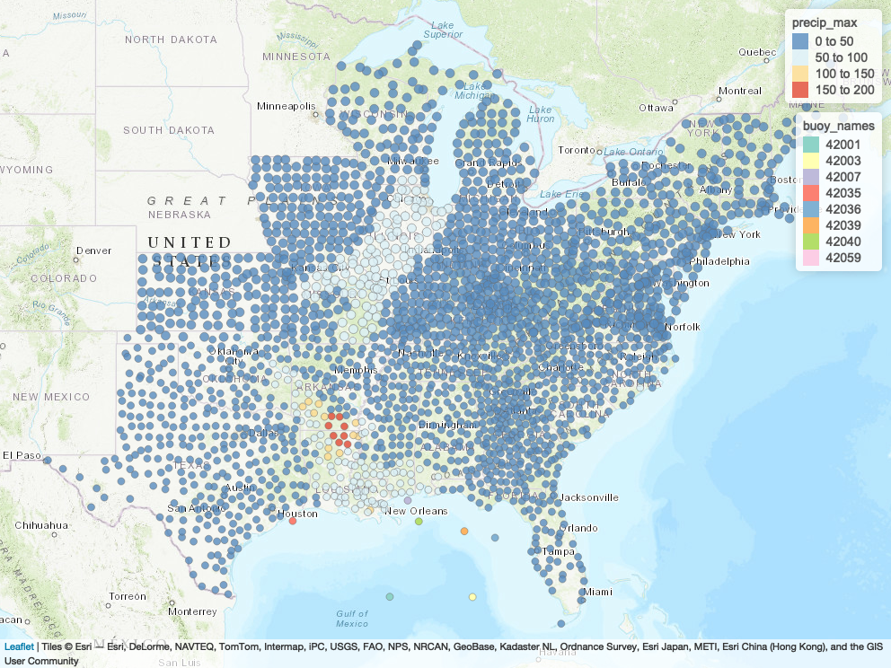

```{r setup, include=FALSE, warning= FALSE, echo=FALSE, message=FALSE}

source("gustav.R")
source("buoy data/timeseries.R")
#source("variogram.R")
source("buoy_map.R")
source("data table.R")
source("variogram_test.R")
source("buoy_hurri_plot.R")

```

\vspace{-0.8cm}

# Abstract

A written report serves better in providing comprehensive information about our analysis and aiding in generating an attractive story. In this report, we aim to discuss the extreme weather conditions caused by Hurricane Gustav after landing in 2008, such as floods and tornadoes. On the other hand, we would like to compare NOAA Buoy data over the sea to inland Hurricane Exposure data and regulate their correlation for Gustav's landfall.

# Introduction

Hurricane Gustav was the second most destructive hurricane in 2008 and caused an economic loss of 6 billion dollars in the United States, 2.3 billion dollars in Cuba, and 210 million dollars in Jamaica. Gustav also caused hundreds of deaths in those countries. According to the National Hurricane Center, hurricane Gustav was formed on August 25th, reached the peak on September 1st, and finally dissipated on September 4th, 2008. Hurricane Gustav made its first landing on Cocodrie, Louisiana, and moved northeast into the Great Lake in the United States. The plot below showed a hurricane exit track of Gustav from the Gulf of Mexico to Great Lake.

```{r echo = F, fig.height=3, fig.align='center'}
# Figure 1, Map of Gustav Track
map_tracks(storms = "Gustav-2008")+
  ggtitle("Gustav Hurricane Tracks")

```

# Extreme Weather Condition

```{r echo = F, fig.height=6, fig.align='center'}
#Figure 2, Rainfall and Buoys Map
rain_buoy

```

Figure 2 shows that Gustav has major rainfall in Louisiana, Arkansas, and Mississippi. As Hurricane Gustav moved to the northeast, the amount of rainfall decreased. It is also well noted that Gustav has caused rainfalls on the east coast.

```{r echo = F, fig.height=6, fig.align='center'}
#Figure 3, Flood Event and Buoys Map
flood_buoy

```

Using the flood and buoy map, Figure 3 we confirmed that high rainfalls caused flooding in those exposed counties of the states. We also notice that the exposure map shows more counties have been exposed to flooding in Missouri. However, there is no flood event on the east coast which suggests that only rainfall above 125 millimeters can cause flooding.

```{r echo = F, fig.height=6, fig.align='center'}
#Figure 4, Wind and Buoys Map
wind_buoy

```

Figure 4 shows that the strong winds are formed at landfall location in Louisiana and along the hurricane track towards the northeast. Noticed that the highest gust wind speed happened at 66.79 m/s in Terrebonne, Louisiana.

```{r echo = F, fig.height=6, fig.align='center'}
#Figure 5, Tornado Event and Buoys Map
tornado_buoy

```

Figure 5 displays a more interesting result as the effect of Hurricane Gustav. Besides those states that are around the hurricane track of Gustav, several counties of Florida had been exposed to tornado events.

# Data Overview

## Gustav-variogram Data

```{r echo = FALSE, message=FALSE}
#Table 1, Hurricane Exposure Data - Rain 
data_1

```

```{r echo = FALSE, message=FALSE}
#Table 2, Hurricane Exposure Data - Storm_winds 
data_2

```

Table 1 and Table 2 display the Hurricane Exposure data table used for variograms. The variables that we mainly worked on are vmax_gust(maximum speed of gust wind in m/s) and precip_max(maximum precipitation in millimeters). Data is cleaned and processed ready for use in geospatial analysis.

## Time Series Data

```{r echo = FALSE, message=FALSE}
#Table 3, Buoy Data for Time Series
data_3

```

Table 3 displays the Buoy data table used for time series plots including datetime and several variables.

# Variograms
```{r echo = F, fig.height=2.5, fig.align='center', out.width= "50%"}
#Figure 6, Spatial Map for Gust Wind


```

Figure 6 shows the maximum precipitation and the locations of buoys we used in this assignment. If we check this picture with Figure 2, the rainfall map, we can find that their ranges are the same. The most significant difference is that the highest value area of Figure 6 is smaller than Figure 2, which is mainly concentrated in the small area on the border of Louisiana and Arkansas.

```{r echo = F, fig.height=4, fig.align='center'}
#Figure 7, Variogram for Max Precipitation
gustav_var$y = as.numeric(gustav_var$latitude)
gustav_var$x = as.numeric(gustav_var$longitude)
coordinates(gustav_var) = ~x+y
spherical_variogram <- function (n, ps, r) function (h) {
  h <- h / r
  n + ps * ifelse(h < 1, 1.5 * h - .5 * h ^ 3, 1)
}
v <- variogram(precip_max ~ 1, gustav_var)
v_fit <- fit.variogram(v, vgm("Sph"))
v_f <- spherical_variogram(v_fit$psill[1], v_fit$psill[2], v_fit$range[2])
h <- seq(0, 100, length = 1000)
plot(v$dist, v$gamma,
     xlab = "distance", ylab = "semivariogram", main="Variogram for Max Precipitation")
lines(h, v_f(h))
abline(v = v_fit$range[2], col = "gray")

```

Figure 7 is calculated and fitted by the spherical variogram model. Distance is calculated by the distance difference between the two randomly paired counties. The increase on the slope of the fitted line demonstrates the increasing variability of maximum precipitation as Gustav travels between two counties. When the fitted line becomes flat which means there is no correlation between two counties and also relates to the dissipation of the hurricane. From Figure we can see that its sill (variance) is close to 700. The range, and the distance at which the variogram reaches the sill, is between 9 and 10.

```{r echo = F, fig.height=4, fig.align='center', warning=FALSE}
#Figure 8, Variogram for Gust Wind
gaussian_variogram <- function (n, ps, r)
  function (h) n + ps * (1 - exp(-(h / r) ^ 2))
v <- variogram(vmax_gust ~ 1, gustav_var)
v_fit <- fit.variogram(v, vgm("Gau"))
v_f <- gaussian_variogram(v_fit$psill[1], v_fit$psill[2], v_fit$range[2])
h <- seq(0, 50, length = 1000)
plot(v$dist, v$gamma,
     xlab = "distance", ylab = "semivariogram", main="Variogram for Max Gust of Wind")
lines(h, v_f(h))
abline(v = v_fit$range[2], col = "gray")

```

Figure 8 is calculated and fitted by the gaussian variogram model. Distance is calculated by the distance difference between two randomly paired counties. The increase in the slope of the fitted line demonstrates the increasing variability of maximum wind speed as Gustav travels between two counties. When the fitted line becomes flat which means there is no correlation between the two counties and also relates to the dissipation of the hurricane.

```{r echo = F, fig.height=4, fig.align='center', warning=FALSE, message=FALSE}
#Figure 9, Kriging Prediction Map for Max Precipitation
proj4string(gustav_var) <- CRS("+init=epsg:28992")
l3 = list("sp.polygons", gustav_var, lwd=.3, first=FALSE)
grd= spsample(gustav_var, n= 5000, type="regular")
grd=as(grd, "SpatialPixels")
gus_kri <- krige(precip_max~1, gustav_var, newdata=grd, model=v_fit)
spplot(gus_kri, "var1.pred", col.regions= rev(topo.colors(20)),
       sp.layout=list(l3), main="Kriging Prediction on Max Precipitation of Gustav")

```

Figure 9 shows a high amount of precipitation is predicted at the landing location in Louisiana and Arkansas. In addition, large amounts of precipitation are also predicted in Illinois and Iowa. However, when we refer back to the Figure 2, the rainfall map, we did not see a high amount of rainfall in Illinois, but the flood event map Figure 9 confirmed that Iowa was exposed to high amounts of precipitation and led to floods. It’s interesting to explore kriging in the way that we can verify the correctness of calculation for our variograms. 

## Empirical Variogram

```{r echo = F, fig.height=4, fig.align='center', message= FALSE, warning=FALSE}
#Figure 10, Empirical Variogram for Gust Wind
gustav_var <- as.data.frame(gustav_var)
vmax_empir <-variog(coords = coord, data = gustav_var$vmax_gust,estimator.type='modulus')
plot(vmax_empir,main = "empirical variogram of vmax_gust")

#Figure 11, Empirical Variogram for Gust Wind
precip_empir <- variog(coords = coord, data = gustav_var$precip_max,estimator.type='modulus')
plot(precip_empir, main = "empirical variogram of precip_max")

```

Unlike the variogram model, the empirical variogram is not a smooth curve because a limited number of samples calculates it. Its distance is also based on the actual situation of the data, which is longer than the variogram. Therefore, the points in the Figure 10 and 11 show a positive correlation, reaching a peak around 10, the same as the variogram. Then the semivariance began to decrease as the distance got farther, and the maximum rainfall and maximum wind gusts near the distance of 30 were close to flat.

# Time Series for Buoys

```{r echo = F, fig.height=6, fig.align='center'}
#Figure 12, Time Series Plot for Gust Speed
GST_PLOT

```

```{r echo = F, fig.height=6, fig.align='center'}
#Figure 13, Time Series Plot for Significant Wave Height
WVHT_PLOT

```

Then the report is going to talk about the time series plots based on the data collected by these eight different buoys. Figure 12 shows the peak 5 or 8-second gust speed (m/s) measured during the eight-minute or two-minute period, the peak gusts gradually reached a maximum around September 1 at noon and fell to normal level then. Figure 13 reveals the significant wave height (meters) calculated as the average of the highest one-third of all of the wave heights during the 20-minute sampling period; similarly, as before, the significant wave height increases dramatically around September 1 morning. Since the NOAA data show the Gustav hurricane made landfall on September 1, at approximately 10 a.m., it indicates that the hurricane rose the gust speed when the hurricane approached the buoys and affected the significant wave height. 

```{r echo = F, fig.height=6, fig.align='center'}
#Figure 14, Time Series Plot for Sea Level Pressures
PRES_PLOT

```

Figure 14 shows the sea level pressure (hPa). It shows that the sea level pressure declined around September 1 morning and then turned to normal level after that. According to the existing reports about the hurricane, it could be found that the sea surface pressure is low at the center of the hurricane. This finding could explain why the sea level pressure declined when the hurricane made landfall.

# Comparison of Buoy and Hurricane Exposure Data
```{r echo = F, fig.height=6, fig.align='center'}
#Figure 15, Comparison Plot of Gust Wind Using Two Datasets
buoy_he

```

Figure 15 displays the comparison of wind speed of Hurricane Gustav on the land using the Hurricane Exposure data (black dots) and on the sea using the NOAA Buoy data (multicolor dots). The wind speed is overall higher on the land than on the sea. However, we can see they portray a similar fluctuation as Hurricane Gustav formed, peaked, and dissipated. We can consider Hurricane Exposure points as a magnification of the buoy data.

# Discussion 

## Missing data for some period:

For Buoy 42003, NOAA only has the data up to August 31st, 2008, and missing data for September and October 2008. Therefore, we are not able to use Buoy 42003 to analyze hurricane landfall. 
For Buoy 42007, NOAA has the data started on August 29th, 2008, so we don’t have complete buoy data before Gustav’s landfall.  

## Buoy location:

Buoy 42059 is located at the Greater Antilles which is far from Gustav’s landfall location which explains why Buoy 42059 showed mild fluctuations in most of our time series plots. However, it is important to include its buoy data in our analysis because Gustav also caused considerable damage in Haiti and Cuba.

# Single buoy to multiple buoys:

While a hurricane is not static, it is obvious that one buoy can only provide useful analytic information when a hurricane is close to it. Multiple buoys ensure that we have more comprehensive and accurate data for landfall analysis. 

## Buoys and Landfall:

We found that none of the buoys listed in the report were right in the eye of the hurricane, they are indeed all along the movement track of Gustav. As a result, our time-series graphs were not as what we expected to drop when Gustav reached the peak and landed in Louisiana. On the contrary, all buoy data also reached the peak level when Gustav was landing in Louisiana on September 1st, 2008.

# Conclusion

Before starting our hurricane analysis project, we assumed that there should be a large discrepancy between the Hurricane Exposure data and NOAA Buoy data because one takes all measurements on land and the other one is on the sea. However, we realized that there are many correlations between them. First of all, buoy locations play an important role in gathering data. If the buoy is right on the hurricane track or on the eye of the hurricane, all measurements will show a rapid concave on the day of hurricane landfall. But based on our buoy locations, all of our buoys are along the track of Gustav. Therefore, our buoy data coincide with hurricane exposure data to reach the peak on the day of landfall. In addition, by comparing the wind speed for both Hurricane Exposure data and NOAA Buoy data, we found that wind speed was overall higher while Gustav was moving on land than on the sea. 

Through this project, we strengthened our data analysis coding skills and complemented our analytical knowledge. Even more, we learned and explored geospatial data analysis, which will aid our future study. This is an excellent adventure for hurricane data.

# References

- Professor Haviland's lecture matrial 
- https://www.ndbc.noaa.gov/hurricanes/2008/gustav/
- https://github.com/geanders/hurricaneexposure
- https://www.nhc.noaa.gov/data/tcr/AL072008_Gustav.pdf
- Professor Luis' discussion material on variogram and kriging

